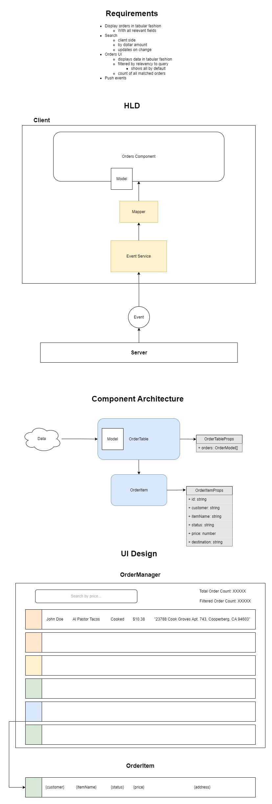

# Real Time Order Tracker
___

The focus on the exercise was to build something that evoked a production grade application. The architecture and structure is absolutely overkill for something this trivial, but it should help demonstrate where things might live and give a sense of how it could scale easily.

## Noteable Features

- Server and client separated into their own modules
- React UI app decoupled from client module
- Framework agnostic services decoupled from UI app
- Use of Typescript
- Use of data models for ingested data

## Design and Architecture

Before attempting projects of this scope, I like to design and diagram what I'm building. Below is a draft:

